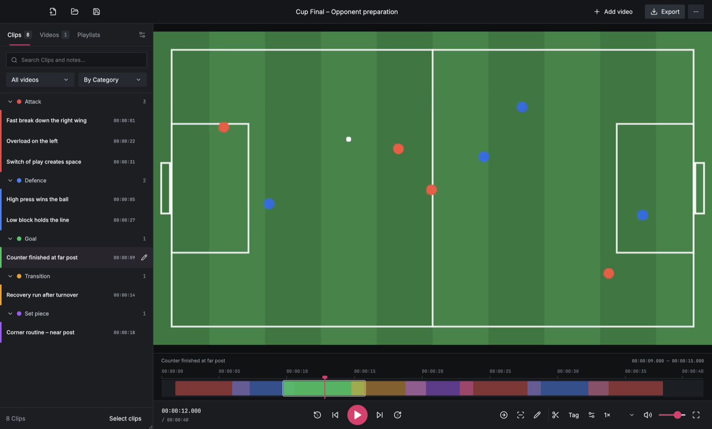
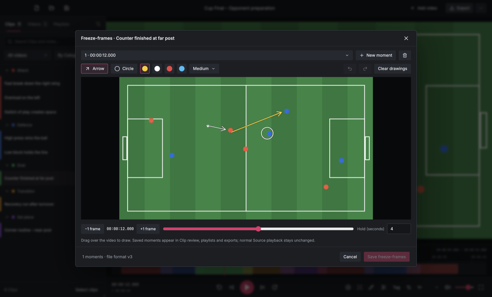
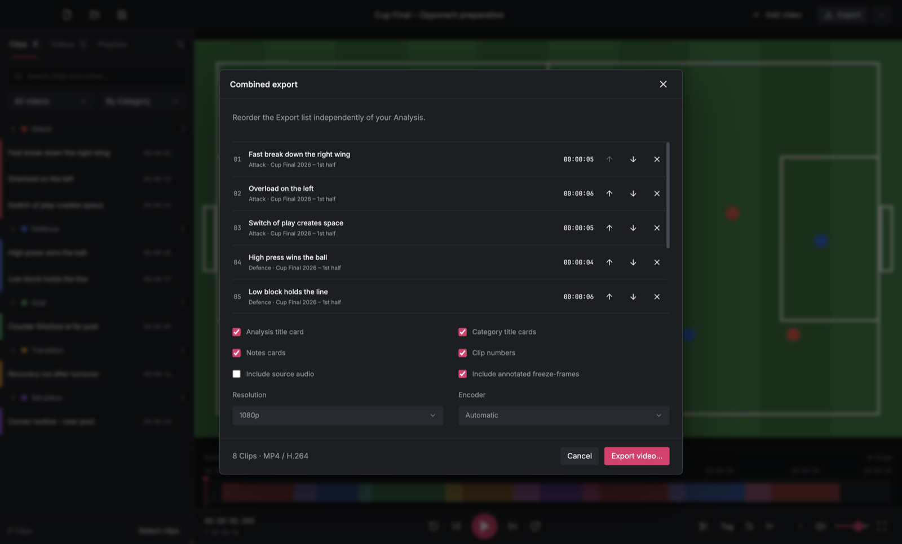

<div align="center">

# 🎬 Tacticut

**Cross-platform sports video analysis for coaches: tag, trim, sequence, and export match footage.**

[](https://github.com/maxwernz/Tacticut/actions/workflows/desktop.yml)


</div>

---

Tacticut (formerly *Video Analyse TS*) is a TypeScript desktop rewrite of the Python/PySide/QML [Video Analyse](https://github.com/maxwernz/Video-Analyse) app. Electron provides the desktop shell, React renders the workspace, and native FFmpeg processes do the video work. You don't need Python installed.

<p align="center">
  
</p>

## ✨ Highlights

- **Live tagging.** Press `1`–`9` during playback to capture a Clip in a Category without pausing.
- **Precise clips.** Mark in/out with `M`, then scrub, trim, and add notes on a single compact timeline.
- **Multiple sources.** Work across several match videos in one Analysis, and relink media if it moves.
- **Coaching playlists.** Build ordered sequences from any Clips, play them back across Source videos, and export them.
- **Freeze-frame coaching.** Pause on key moments, draw arrows and circles, and include those holds in playback and exports.
- **Fast native export.** FFmpeg renders 720p/1080p combined exports with title, Category, and notes cards. It shows progress and can be cancelled.
- **Safe by design.** Saves use atomic replacement, a crash-recovery snapshot protects unsaved edits, the renderer is sandboxed, and IPC goes through a narrow preload bridge.
- **Backward compatible.** It reads and writes the Python app's `.analysis` files and imports legacy pickle files safely.

## 📸 Screenshots

<table>
  <tr>
    <td width="33%"></td>
    <td width="33%"></td>
    <td width="33%"></td>
  </tr>
  <tr>
    <td align="center"><strong>Coaching playlists</strong></td>
    <td align="center"><strong>Freeze-frame annotations</strong></td>
    <td align="center"><strong>Combined export</strong></td>
  </tr>
</table>

<sub>The screenshots use a synthetic demo video.</sub>

## 🚀 Getting started

Requires **Node.js 22.12+** (Node 24 recommended).

```sh
npm ci        # installs dependencies, including native FFmpeg/ffprobe binaries
npm run dev   # launches the app with hot reload
```

Production build:

```sh
npm run build
npm start
```

Installing needs internet access. After that, the app processes all media locally.

## ⌨️ Keyboard shortcuts

| Key                         | Action                                                 |
| --------------------------- | ------------------------------------------------------ |
| `Space`                     | Play / pause (also pauses/resumes playlist sequences)  |
| `←` / `→`                   | Step one frame                                         |
| `Shift` + `←` / `→`         | Jump five seconds                                      |
| `↑` / `↓`                   | Increase / decrease playback speed                     |
| `M`                         | Mark Clip start, then press again to mark the end      |
| `1`–`9`                     | Quick-capture a Clip in that Category (sidebar order)  |
| `Esc`                       | Leave batch selection / stop playlist playback         |
| `Cmd/Ctrl` + `S`            | Save                                                   |

Shortcuts are ignored while a text field or dropdown has focus. New, Open, Save As, Add Source videos, and Combined export are also in the native menus.

## 🧭 Workflow

<details>
<summary><strong>Sources and playback</strong></summary>

- Add Source videos with the button or by dragging them onto the window. Use the **Videos** tab to switch, rename, reorder, remove, and relink them.
- Playback speed and volume controls sit below the video. The timeline scrubs, selects ranges, and jumps to a Clip's start when you double-click it.

</details>

<details>
<summary><strong>Creating and editing Clips</strong></summary>

- Press **M** to mark a start and again to mark the end. Then save the Clip draft with a name, Category, boundaries, and notes. Cancelling a draft leaves the Analysis unchanged.
- Quick capture (`1`–`9` or the **Tag** menu) uses 8 s of context before the playhead and 3 s after it by default. Change this per device with the settings button beside Tag. Quick capture doesn't pause playback or disturb a pending manual start. It ignores held-key repeats and clamps clips to the video's boundaries.
- Click a Clip to jump to it. Double-click it or use the pencil button to edit.
- Filter Clips by Source video, search names, notes, and Categories, and sort by Category, start time, or creation order.
- **Select clips** shows checkboxes for batch export, deletion, or adding to a playlist.
- Manage Categories with the sidebar settings button. The Analysis menu edits the reusable Category template.

</details>

<details>
<summary><strong>Playlists</strong></summary>

- Create named coaching sequences. **Add Clips** searches existing Clips, the arrows reorder them, and × removes only the playlist reference. A Clip can belong to several playlists but appears only once in each.
- **Play playlist** plays each Clip in order and switches Source videos as needed. Click a row to start from that Clip. Seeking, editing, or opening dialogs cancels the sequence. Switching sources may briefly buffer, so playback isn't gapless.
- **Export playlist** opens the export dialog with the Clips in playlist order.

</details>

<details>
<summary><strong>Export</strong></summary>

- Export the selected Clips, or all Clips if none are selected. You can reorder the export list and choose title, Category, and notes cards, Clip numbers, source audio, and 720p or 1080p output.
- On macOS, Automatic mode tries VideoToolbox hardware encoding and falls back to software. Windows uses the `veryfast` software H.264 encoder.

</details>

<details>
<summary><strong>Freeze-frame coaching</strong></summary>

- Select a Clip, move the playhead to a frame, and click **Annotate selected Clip**. Finish or cancel any Clip draft or playlist playback first.
- Drag to draw **arrows** and **circles/ellipses**, choose a color and thickness, and set a **0.5–15 s hold**. **New moment** adds another freeze to the same Clip. Undo/redo, Clear drawings, and Delete coaching moment only take effect when you click **Save freeze-frames**. Cancel asks before discarding changes.
- **Review Clip with freeze-frames** and playlist playback pause on each saved hold, then resume the footage. `Space` pauses or resumes a hold, and **Continue now** skips the rest of it. Stopping, seeking, changing Clips, or opening a dialog cancels the pending auto-resume. Fullscreen presentation shows the drawings.
- Combined export includes freeze-frames by default and is silent during each hold. Uncheck **Include annotated freeze-frames** to keep the original Clip timings. Drawings are stored in normalized picture coordinates and rasterized natively for export.
- Drawings follow their Clip into every playlist it appears in, and deleting a Clip deletes its moments. A trim that would exclude a moment is rejected. Shapes can't be dragged after drawing, and there's no automatic player tracking yet.
- Frame stepping uses the nominal FPS. Check converted or variable-frame-rate footage visually.

</details>

## 🏗️ Architecture

```text
┌─────────────────────────── Electron ───────────────────────────┐
│  Renderer (sandboxed, no Node)        Main process              │
│  ┌──────────────────────────┐        ┌───────────────────────┐ │
│  │ React workspace          │  IPC   │ Native menus/dialogs  │ │
│  │  App · Player · Dialogs  │◄──────►│ Atomic file I/O       │ │
│  │  domain.ts (model/codec) │preload │ Media streaming proto │ │
│  └──────────────────────────┘        │ FFmpeg / ffprobe jobs │ │
│                                      └───────────────────────┘ │
└─────────────────────────────────────────────────────────────────┘
```

| Layer                                                  | Where                                     |
| ------------------------------------------------------ | ----------------------------------------- |
| Analysis model, codec, invariants, export ordering     | `src/domain.ts`                           |
| React editing and document lifecycle                   | `src/App.tsx`                             |
| Video element, transport, timeline                     | `src/Player.tsx`                          |
| Playlists and sequence playback                        | `src/Playlists.tsx`, `src/useSequencePlayback.ts` |
| Native menus and dialogs, restricted IPC, media streaming | `electron/main.ts`, `electron/preload.ts` |
| Atomic persistence, relative paths, media fingerprints | `electron/files.ts`                       |
| Probing and codec fallback copies                      | `electron/media.ts`                       |
| Freeze-frame model, editor, canvas, export rasterizing | `src/annotations.ts`, `src/AnnotationEditor.tsx`, `src/AnnotationCanvas.tsx`, `electron/annotations.ts` |
| Legacy pickle import                                   | `electron/legacy.ts`                      |
| Export preflight, rendering, cancellation              | `electron/export.ts`                      |

### Performance choices

- Frames never pass through JavaScript. FFmpeg does all decoding, encoding, and compositing natively.
- Exports run in async child processes. Each Clip is normalized into a temporary segment, and the final concatenation is stream-copied. This keeps memory bounded but uses temporary disk space.
- While a video plays, the playhead updates the DOM directly, so the Clip list doesn't rerender. Scrubbing is coalesced to animation frames.
- Checking a Source video's identity hashes three 64 KiB regions, not the whole file.
- Codecs the player can't handle are converted on demand into a cached 720p H.264/AAC playback copy. Exports still use the original media.

> Electron uses more RAM and disk space than Qt or Tauri. TypeScript is used here for the editing and document logic, and native code still does the expensive media work. The rewrite hasn't been benchmarked against the Python app.

## 📁 File compatibility

| Schema | Written when                  | Readable by                 |
| ------ | ----------------------------- | --------------------------- |
| v1     | Analysis has no playlists     | Python app and this app     |
| v2     | Analysis contains playlists   | This app only               |
| v3     | Clips have freeze-frames      | This app only               |

- `.analysis` files are JSON. The app keeps UUIDs, Clip creation order, Categories, notes, and external Source-video references intact. It uses the Python app's three-region SHA-256 media fingerprint.
- Relative Source-video paths let you move the media folder together with the Analysis. You can relink missing media without losing Clips.
- Older apps reject v2 and v3 files instead of silently dropping playlists or drawings. To keep a copy they can open, use **Save As** first. If you remove all freeze-frames, later saves go back to v2 or v1.
- Saves check for external changes first. After an abnormal exit, the app offers a debounced recovery snapshot on the next launch.
- **Legacy pickle files** (`treewidget_item.ClipItem`) are imported with a restricted, data-only reader. It never imports Python globals or runs constructors. Files are limited to 32 MiB, and you must Save As to a new JSON file.

## 🧪 Testing and packaging

```sh
npm test              # domain, persistence, React workflows, real FFmpeg exports
npm run test:e2e      # builds and drives the Electron app with Playwright
npm run package:mac   # run on ARM64 macOS  → release/*.dmg
npm run package:win   # run on x64 Windows  → release/*.exe (NSIS)
```

Build each package on its target OS so the bundled FFmpeg binaries match. Packages are unsigned unless you configure a signing identity. GitHub Actions tests and packages macOS and Windows independently on every push.

Native dependencies ship with their own license files. The bundled fonts (Inter, JetBrains Mono, Noto Sans) are under the SIL Open Font License.

---

See [MIGRATION.md](MIGRATION.md) for parity decisions against the Python app and the remaining validation work.
